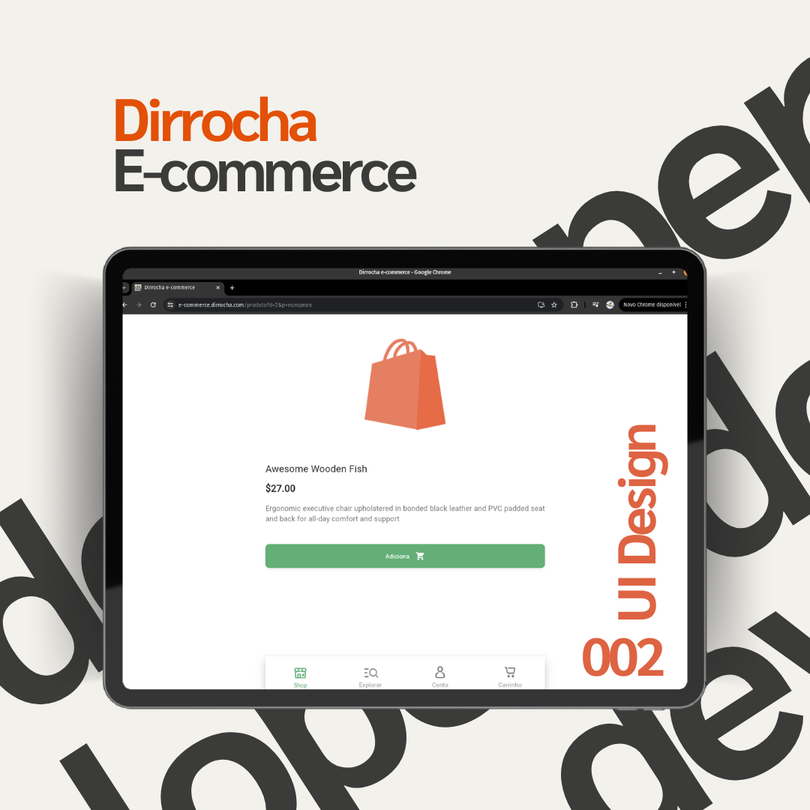
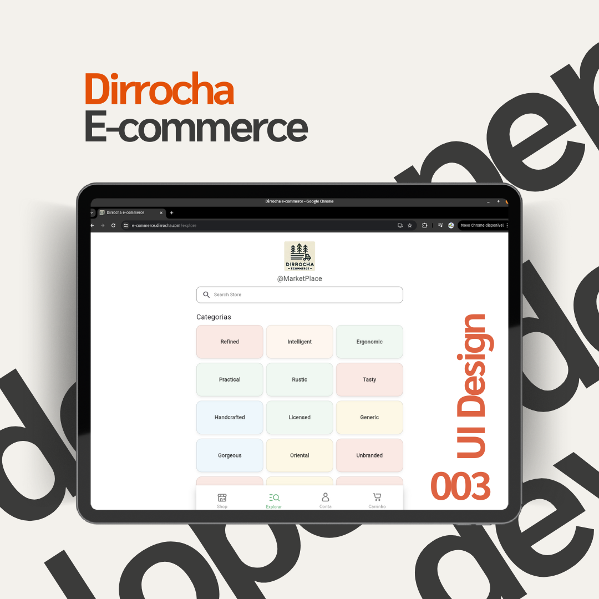
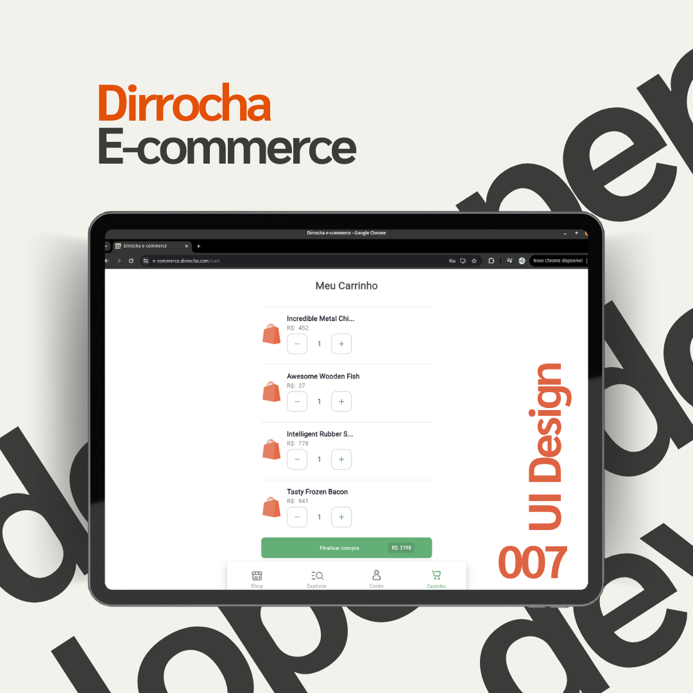
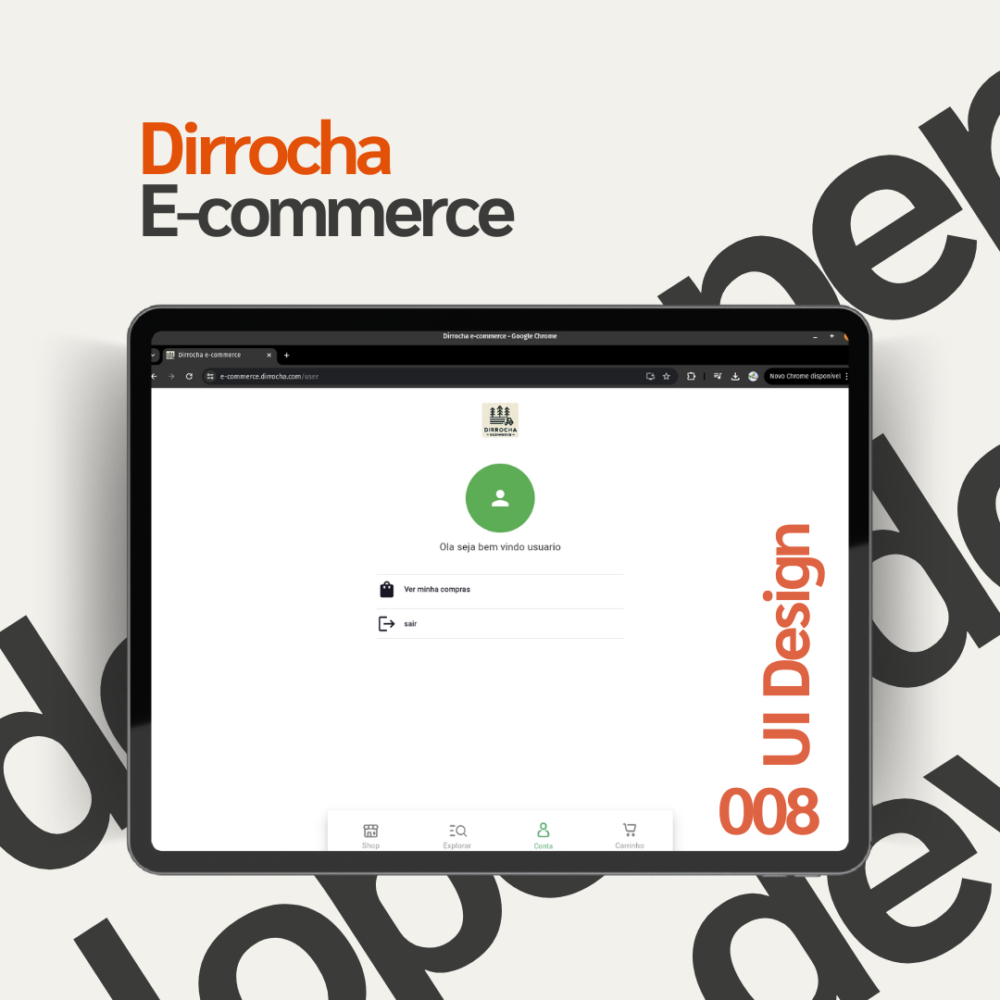
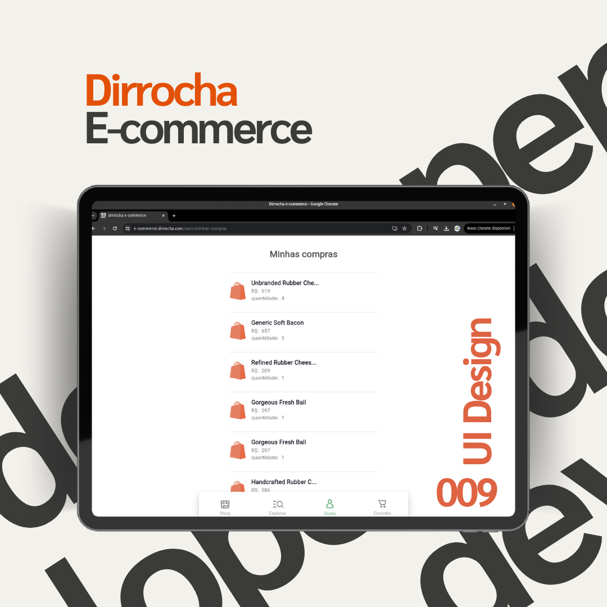
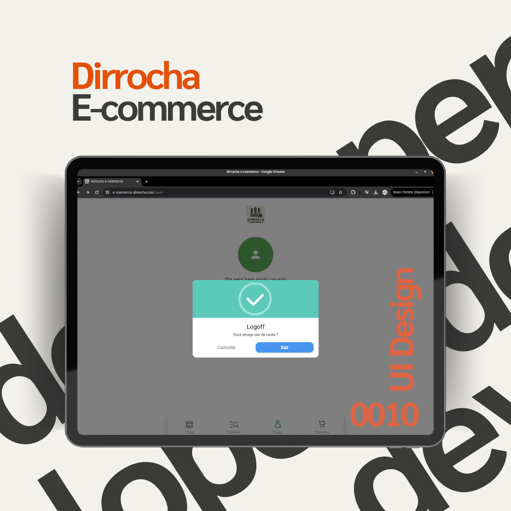

# Front-End E-commerce


- acessa em [e-commerce.dirrocha.com](https://e-commerce.dirrocha.com)

Este projeto de E-commerce foi desenvolvido como parte de um desafio técnico . O objetivo foi construir uma aplicação completa, cobrindo tanto o front-end quanto o back-end, para atender aos requisitos de uma loja online fictícia.

## Visão Geral do Projeto

O projeto consiste em uma aplicação de e-commerce fictícia, onde o cliente pode navegar, pesquisar e comprar produtos fornecidos por duas APIs externas. O front-end foi construído utilizando Flutter, enquanto o back-end foi desenvolvido com NestJS, gerenciando a lógica de negócios e o armazenamento dos dados.

### Decisões de Desenvolvimento

- **Escolha do Flutter para o Front-End**: Optou-se por Flutter devido à sua capacidade de construir interfaces de usuário nativas para dispositivos móveis e web, com uma única base de código. Isso garante consistência na experiência do usuário e acelera o processo de desenvolvimento.

- **Integração com APIs Externas**: As duas APIs fornecidas foram integradas para consumir e listar todos os produtos disponíveis na loja. A escolha foi feita para facilitar a escalabilidade e permitir que novos fornecedores possam ser adicionados facilmente no futuro.

- **Sistema de Busca Avançada**: Implementou-se algoritmos de busca avançada como Fuzzy.js, para garantir que os usuários possam encontrar produtos específicos de maneira eficiente. O sistema foi configurado para lidar com grandes volumes de dados sem sacrificar a performance.

- **Persistência e Segurança dos Dados**: O back-end foi configurado para registrar cada compra realizada, incluindo os dados do cliente e dos produtos comprados. A segurança dos dados foi garantida através de criptografia e autenticação JWT.

### Funcionalidades Principais

- **Splash Screen**:
  - A aplicação inclui uma splash screen que é exibida durante o carregamento inicial, proporcionando uma transição suave para a interface principal do aplicativo.

- **Autenticação de Usuário**:
  - Sistema de login e registro com criptografia de dados sensíveis para garantir a segurança das informações do usuário.
  - Utilização de JWT (JSON Web Token) para manter a sessão do usuário segura durante a navegação.

- **Navegação e Visualização de Produtos**:
  - Interface intuitiva que permite aos usuários navegar por diferentes categorias de produtos.
  - Página de detalhes do produto, onde o usuário pode visualizar informações completas sobre o item.

- **Sistema de Busca Avançada**:
  - Implementação de algoritmos de busca avançada, como o Fuzzy.js e algoritmos de pares ordenados, para melhorar a precisão dos resultados de pesquisa.
  - Estes algoritmos são executados no web service consumido pela aplicação, oferecendo uma experiência de busca eficiente e rápida.

- **Carrinho de Compras**:
  - Funcionalidade para adicionar e remover produtos do carrinho.
  - Exibição de produtos no carrinho, com a opção de finalizar a compra.
  - Histórico de compras finalizadas, permitindo ao usuário revisar suas transações anteriores.

- **Validação e Segurança**:
  - Regras de validação de campos e páginas para garantir que os dados inseridos pelos usuários sejam válidos.
  - Sistema de segurança que inclui popups e alertas animados e personalizados, para uma melhor experiência do usuário.

- **Otimização de Performance**:
  - O aplicativo foi otimizado para garantir um desempenho fluido, mesmo em dispositivos com recursos limitados.
  - Estratégias como carregamento assíncrono de dados, uso eficiente de widgets e gerenciamento eficaz de estado foram implementadas para maximizar a performance.

### Deploy e Infraestrutura

- **Build de Produção**:
  - O sistema front-end foi buildado em modo **release**, garantindo um código otimizado e leve para ser servido aos usuários finais.

- **Docker Compose**:
  - A aplicação é containerizada utilizando Docker, permitindo uma fácil distribuição e escalabilidade.
  - O Docker Compose é utilizado para orquestrar os contêineres, facilitando o gerenciamento da aplicação e de seus serviços auxiliares.

- **Serviço Web com NGINX**:
  - A aplicação é servida utilizando uma imagem Docker do NGINX, que atua como servidor web para entregar o front-end.
  - Um proxy reverso foi configurado no NGINX para garantir o endereçamento correto das requisições, especialmente na comunicação com o back-end e na manipulação de diferentes endpoints.

## Estrutura do Projeto

O front-end foi desenvolvido utilizando o Flutter, garantindo uma experiência nativa e responsiva em dispositivos móveis. O código está organizado da seguinte forma:

- **components**: Contém componentes reutilizáveis que são utilizados em diversas partes do projeto, permitindo modularidade e reutilização do código.

- **CustomMessages**: Diretório dedicado às mensagens personalizadas usadas na aplicação, possivelmente contendo mensagens de erro, validações, ou qualquer outro texto customizável que possa ser exibido aos usuários.

- **effects**: Contém animações ou efeitos visuais que são aplicados na interface do usuário, garantindo uma experiência mais atraente e interativa.

- **entities**: Reúne definições de entidades ou modelos de dados que estruturam a forma como os dados são manipulados dentro da aplicação. É fundamental para a interação consistente com a API e o gerenciamento do estado.

- **pages**: Diretório que contém as páginas principais da aplicação, como a página inicial, página de login, página de produto, página de carrinho, etc.

- **services**: Inclui serviços que comunicam com a API back-end, gerenciam o estado da aplicação, e manipulam dados locais. Este diretório é essencial para a lógica de negócio da aplicação.

- **app.dart**: Contém a configuração principal da aplicação, como o tema, a configuração das rotas principais e outros setups globais.

- **main.dart**: O ponto de entrada da aplicação, onde a execução começa. Geralmente, este arquivo inicializa o app e configura o ambiente de execução.

- **route.dart**: Contém a configuração das rotas da aplicação, definindo como a navegação entre as diferentes páginas é gerenciada.

## Tecnologias Utilizadas

- **Flutter**: Framework de desenvolvimento de UI para construir aplicações nativas.
- **NestJS**: Framework para o back-end, utilizado para construir a API RESTful.
- **Fuzzy.js**: Biblioteca JavaScript para busca aproximada, utilizada na funcionalidade de pesquisa.
- **JWT (JSON Web Token)**: Para autenticação segura dos usuários.
- **Docker & Docker Compose**: Para containerização e orquestração da aplicação.
- **NGINX**: Para servir a aplicação Flutter e gerenciar o proxy reverso.

## Passos para Instalação

Necessario ter o docker compose e o flutter instalado

1. **Clone o Repositório**:

   ```bash
   git clone https://github.com/marco0antonio0/E-commerce_front-end
   cd E-commerce_front-end
   ```

2. **Instale as Dependências do Front-End**:

   ```bash
   flutter pub get
   ```

3. **Build da Aplicação**:

   ```bash
   flutter build web
   ```

4. **Configuração do Docker**:
   - Certifique-se de que o Docker e o Docker Compose estão instalados em sua máquina.
   - Para iniciar a aplicação, utilize o comando:

   ```bash
   docker-compose up --build
   ```

5. **Acesse a Aplicação**:
   - A aplicação estará disponível em `http://localhost:3005` após o Docker Compose iniciar todos os serviços.

## Paginas - web

#

#### Pagina Shop


#

#### Pagina Produto



#

#### Pagina Categorias



#

#### Pagina Login


#

#### Pagina Cadastro


#

#### Pagina Pesquisa de produtos


#

#### Pagina de Carrinho de compras



#

#### Pagina Usuario



#

#### Pagina Carrinho de compras concluidas



#

#### Pagina Logoff da conta



## Link para o Back-End

O código fonte do back-end pode ser encontrado no seguinte repositório: [E-commerce Back-end](https://github.com/marco0antonio0/E-commerce_back-end).
